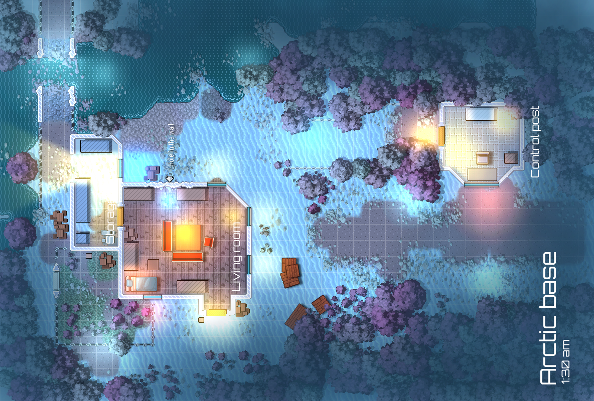
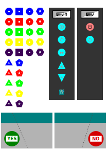
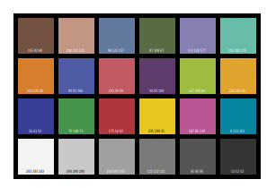

# Smart Board Games Construction Kit

## Development game

Used for testing / developing the APIs.

## Tools

Linux

```bash
$ sudo apt-get install imagemagick
$ sudo apt-get install sox
```

Windows:

```cmd
choco install imagemagick
choco install sox.portable
```

ToDo:

- Batch converter <https://stackoverflow.com/questions/48884679/sox-batch-conversion>
- Normalize with  sox --norm or vorbisgain


## How to create image maps

This is done with Gimp: Filter/Map/Imagemap.

We convert them to json.

## What to print?

Board: [boards/Arctic-base.png](boards/Arctic-base.png)


- File taken from here <https://deepnight.net/tools/rpg-map/#&gid=1&pid=4>
- Use A4 poster print (2 pages)
- Experiment with the paper type.
  - For my Canon Inkjet it's ok to use the super glossy photo paper. Be warned! Reflections might cause OpenCV to behave very strange.

Tokens: [svg/no_auto_create/token_all.svg](svg/no_auto_create/token_all.svg)

  - Images taken from here <https://opengameart.org/content/pixel-art-units-from-elite-command>

Color Checker: [svg/no_auto_create/color_checker_old.svg](svg/no_auto_create/color_checker_old.svg)


## I18n

- TTag: https://ttag.js.org/docs/typescript.html
- We use PO getText translation flags.

```typescript
  this.text(t`${ narrator }Please make sure the camera is working, please check the zoom level and make sure it can see the playfield.`);
```

## Build Commands

Main command

```bash
node launcher.js game
```

Other commands:

```bash
node launcher.js po -s ./src -t ./dist/po -l en,de,fr

node launcher.js po -s ./src -t ./dist/po -l en

node launcher.js tts -s ./dist/po -t ./dist/audio

node launcher.js tts -s ./dist/po -t ./dist/audio -m ./tts-map.json

node launcher.js map -s ./boards -t ./dist/boards

node launcher.js svg2png -s ./svg -t ./dist/assets

node launcher.js game
```
